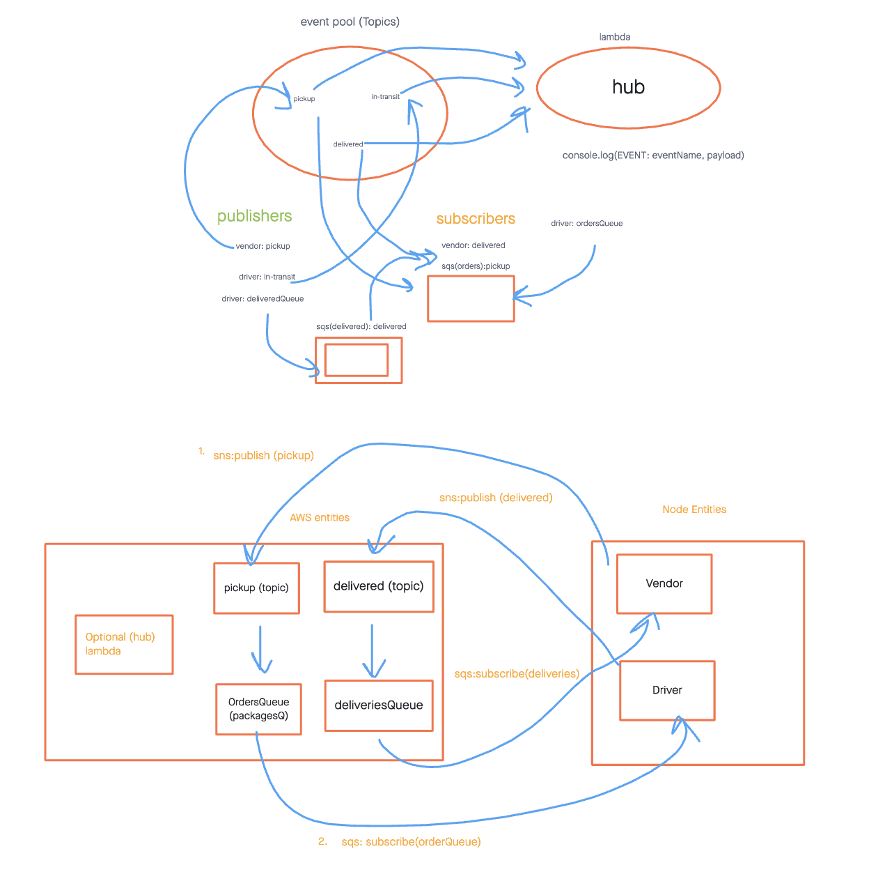

# Lab: AWS: Events

## Overview

In this lab, we aim to create a cloud version of the CAPS system using only AWS services, specifically Amazon Simple Queue Service (SQS) and Simple Notification Service (SNS). The CAPS system is designed to facilitate communication between vendors and drivers for delivery management.

## Feature Tasks & Requirements

### Required Services

- **SNS Topic (FIFO): pickup**: This topic will receive all pickup requests from vendors.
- **SQS Queue (FIFO): packages**: It will contain all delivery requests from vendors in the order of receipt. Subscribe this queue to the "pickup" topic to ensure ordered pickups.
- **SQS Queue (Standard) for each vendor (named for the vendor)**: Each vendor will have a dedicated SQS Standard Queue to receive delivery notifications from the drivers.

### Operations

#### Vendors:

- Vendors will post "pickup" messages containing delivery information into the SNS "pickup" topic.
  - Message format: `{ orderId: 1234, customer: "Jane Doe", vendorUrl: queueUrl}`.
  - Note: `queueUrl` refers to the AWS URL of the vendor's specific SQS Standard Queue.
- Pickup requests will automatically be moved into an SQS FIFO Queue called "packages" for the drivers.
  - The "packages" queue should be a subscriber to the "pickup" topic.
- Vendors should separately subscribe to their personal SQS Standard Queue and periodically poll the queue to see delivery notifications.

#### Drivers:

- Drivers will poll the "packages" queue and retrieve the delivery orders (messages) in order.
- After a set time (e.g., 5 seconds), drivers will post a message to the vendor's specific SQS Standard Queue using the `queueUrl` specified in the order object.

### Implementation Notes

- Work in a non-main branch in a new repository called "caps-cloud."
- After setting up the appropriate queues and topics in SNS and SQS, you'll need Node.js applications to run the system.

### `vendor.js`

- This application should function as an SQS Subscriber.
- Connect it to the "pickup" topic by using its URL/ARN.
- Set it up to produce a new message to the "pickup" topic every few seconds, simulating an order.
- The order ID and customer name can be randomized.
- Include the URL to the vendor's personal delivery queue.
- Connect it to the vendor's own queue by using its URL.
- As drivers deliver, this app will continually poll the queue, retrieve them, and log details out to the console.
- You should be able to disconnect this app and see deliveries that happened while the app was not running.

### `driver.js`

- This application should connect to the "pickup" queue and get only the next package.
- Wait a random number of seconds.
- Post a message to the vendor's "delivered" Queue using the supplied URL in the order/message to alert them of the delivery.
- Repeat this process until the queue is empty.
- You should eventually be able to have multiple drivers and vendors wired up and acting in concert.

## UML 

## Author

Adnan Mohamud

## License

This project is licensed under the MIT License - see the [LICENSE](LICENSE) file for details.
